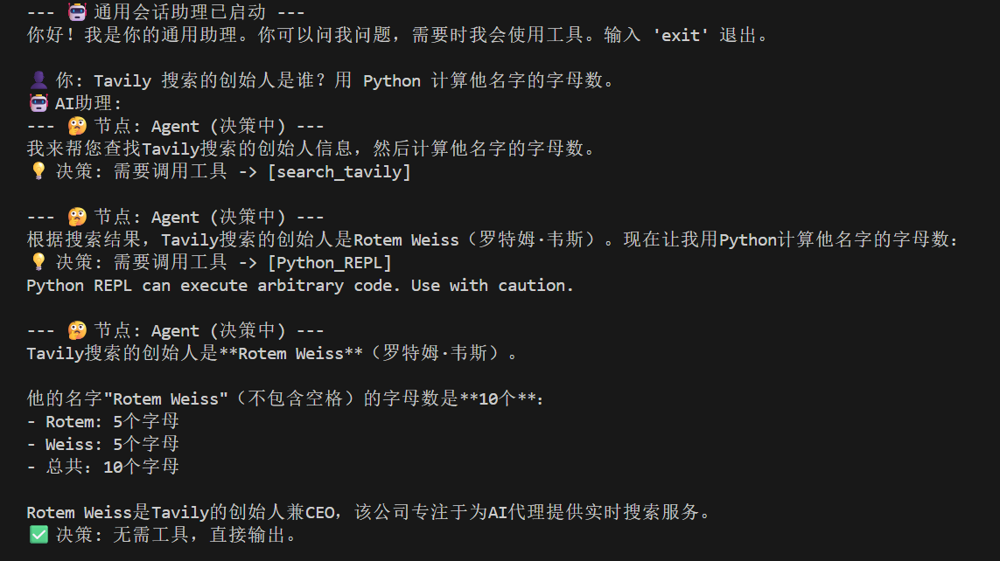

## 1. 引言
欢迎来到Agent开发的世界！本文档旨在详细介绍一个基于Langchain和LangGraph构建的模块化Agent脚手架。该框架的核心思想是将Agent的各个功能部分（如状态管理、大语言模型、工具集、图逻辑等）解耦，使其易于理解、维护和扩展。

我们将首先概览整体架构，然后深入剖析每个核心组件，最后通过一个具体的sample_agent1.py示例，展示如何利用这个脚手架快速构建一个具备工具调用能力的会话式Agent。

## 2. 整体架构概览
我们的Agent本质上是一个状态机。它从一个初始状态（用户提问）开始，通过一系列**节点（Nodes）和边（Edges）**的流转，不断更新自身状态，直到达到最终状态（回答问题）。LangGraph正是用于定义和执行这种状态图的强大工具。

### 2.1 核心组件
这个脚手架将Agent拆分为以下几个核心目录/文件：

* `core/state.py`: 定义Agent的“记忆”或状态结构（可根据业务自行扩展）。

* `core/llms.py`: 统一管理和初始化大语言模型（LLM），即Agent的“大脑”。

* `core/tool.py`: 定义Agent可以使用的外部工具，即Agent的“双手”。

* `core/graph.py`: 提供一个通用的图构建函数，用于组装Agent的“骨架”。

* `core/executor.py`: 封装编译好的图，提供一个简洁的调用接口。

* `sample_agent1.py`: 一个具体的Agent实现示例，展示如何将上述所有组件组装起来。


### 2.2 Agent工作流架构

* 决策 (agent): “大脑”接收当前状态，决定下一步是直接回答还是调用工具。

* 路由 (should_continue): 根据“大脑”的决策，决定是去执行工具还是结束流程。

* 行动 (tools): 如果需要，就使用“双手”执行具体任务。

* 循环: 行动的结果会作为新的信息，再次送回“大脑”进行下一轮决策，直到问题解决。

## 3. 核心组件深度解析
`core/state.py` - Agent的状态中心
这个文件定义了Agent在整个工作流程中需要追踪和更新的数据结构。

作用: 它是Agent的全局“内存”。图中的每个节点都可以读取和修改这个状态。

```Python
from typing import TypedDict, Annotated, List
import operator
from langchain_core.messages import BaseMessage

class BaseAgentState(TypedDict):
    messages: Annotated[List[BaseMessage], operator.add]
```
TypedDict: 提供了清晰的数据结构定义。

messages: 存储了从用户提问开始的所有对话历史。

Annotated[..., operator.add]: 这是LangGraph的一个核心特性。它告诉图，当任何节点返回一个名为messages的键时，不要用新值覆盖旧值，而是将新消息追加到现有列表中。这保证了对话历史的连续性。

`core/llms.py` - 大语言模型工厂
这个文件将LLM的初始化逻辑封装起来，使得切换不同的模型提供商变得非常容易, 同时也为Agent提供了一个统一的接口。

```Python
def get_llm(provider: SUPPORTED_PROVIDERS = "deepseek", ...):
    # ... 根据provider返回不同的ChatModel实例
```
通过传入一个字符串（如"openai", "deepseek"），就能轻松获得一个配置好的LLM实例，无需在业务代码中关心具体的API Key和模型名称。这极大地提高了代码的灵活性。

`core/tool.py` - Agent的工具箱
这里定义了Agent能够使用的所有外部能力。

作用: 扩展Agent的能力边界，使其能获取实时信息（网络搜索）或执行复杂计算（代码执行）。

```Python
from langchain_core.tools import tool
from langchain_experimental.tools import PythonREPLTool

@tool
def search_tavily(query: str):
    """
    ... Docstring as tool description ...
    """
    # ... function logic ...

python_repl_tool = PythonREPLTool()
agent_tools = [search_tavily, python_repl_tool]

```
@tool装饰器: 能自动将一个Python函数转换为LangChain工具。函数的**文档字符串（docstring）**至关重要，LLM会读取它来理解这个工具的功能、用途和参数，从而决定何时以及如何使用它。

agent_tools列表: 将所有工具统一管理，方便后续绑定到LLM上。

`core/graph.py` - 通用图构建器
这是脚手架的核心价值所在，它将LangGraph图的构建过程模板化,提供一个标准化的函数`build_agent_app`，根据传入的节点和边定义，快速组装出一个可执行的Agent应用。

```Python
from langgraph.graph import StateGraph, END

def build_agent_app(state_schema, nodes, entry_point, edges=None, conditional_edges=None):
    workflow = StateGraph(state_schema)
    # 1. 添加节点
    # 2. 设置入口
    # 3. 添加普通边
    # 4. 添加条件边
    return workflow.compile()
```
使用者无需关心StateGraph的底层API，只需准备好“零件”（节点、状态）和“装配图”（边、入口），这个函数就能自动完成组装。

`core/executor.py` - Agent的执行接口
这个类为编译好的Agent图提供了一个用户友好的高级接口。简化与Agent的交互，无论是需要一次性获得结果 (invoke) 还是实时获取流式输出 (stream)。

```Python
from typing import AsyncGenerator

async def stream(self, query: str) -> AsyncGenerator[str, None]:
    async for event in self.app.astream_events(initial_state, version="v2"):
        kind = event["event"]
        if kind == "on_node_start":
            name = event["name"]
            yield f"\n> **正在执行节点: {name}...**\n"
        if kind == "on_chat_model_stream":
            content = event["data"]["chunk"].content
            if content:
                yield content
```
stream方法通过监听astream_events，可以捕获到图执行过程中的各种事件，如节点开始执行、LLM生成token等，从而实现丰富的实时反馈。

## 4. `sample_agent1.py` - 实例串讲
现在，我们来看看sample_agent1.py是如何利用上述所有核心组件，构建一个完整的会话助理的。

第一步：定义状态和工具
该Agent直接复用了`core/state.py`中的BaseAgentState，并从`core/tool.py`导入了agent_tools。

第二步：定义节点
agent_node: 这是核心决策节点。它调用get_llm获取一个绑定了工具的LLM。LLM接收整个对话历史 (state["messages"])，然后输出一个包含决策的AIMessage。这个决策可能是直接的文字回答，也可能是一个tool_calls请求。

ToolNode(agent_tools): 这是LangGraph预置的工具节点。它会自动接收agent_node发出的tool_calls请求，执行对应的工具，并将结果封装成ToolMessage返回。

第三步：定义边（逻辑流）
这是Agent智能的关键。

条件边 should_continue: 这个函数检查agent_node返回的最新消息。

如果消息中包含tool_calls，说明LLM决定使用工具，函数返回字符串"tools"。

如果没有tool_calls，说明LLM认为可以直接回答，函数返回END（一个LangGraph中的特殊常量，表示流程结束）。

普通边 ("tools", "agent"): 这条边定义了工具执行完毕后，流程应该回到agent节点，让LLM基于工具返回的结果进行下一步的思考。

第四步：组装和运行
```Python
a. 定义节点字典
nodes = {"agent": agent_node, "tools": ToolNode(agent_tools)}

b. 使用脚手架构建应用
agent_graph = build_agent_app(
    state_schema=AgentState,
    nodes=nodes,
    entry_point="agent",
    conditional_edges={
        "agent": {
            "path": should_continue,
            "path_map": {"tools": "tools", END: END}
        }
    },
    edges=[("tools", "agent")]
)

c. 初始化执行器
agent = AgentExecutor(app=agent_graph)

d. 运行交互式聊天
import asyncio
asyncio.run(chat())
```


这里完美展示了脚手架的威力：开发者只需专注于定义自己Agent的节点逻辑和流转条件，然后将这些“零件”喂给build_agent_app，即可轻松得到一个功能完备的Agent应用。最后，通过AgentExecutor就能方便地与之交互。

运行效果展示
当运行`sample_agent1.py`并提出问题:“Tavily搜索的创始人是谁？用 Python 计算他名字的字母数。”，其内部流程和最终输出将如下所示。

内部执行流程追溯
用户输入: "Tavily搜索的创始人是谁？用 Python 计算他名字的字母数。"

第一次循环:

* **`agent_node`**: LLM分析后认为需要信息，决定调用search_tavily工具。

* **`should_continue`**: 检测到工具调用，返回"tools"。

* **`tools_node`**: 执行search_tavily(query="Tavily founder")，返回创始人是"Rotem Weiss"。

第二次循环:

* **`agent_node`** : 接收到"Rotem Weiss"的信息，现在需要计算字母数，决定调用python_repl工具。

* **`should_continue`**: 再次检测到工具调用，返回"tools"。

* **`tools_node`**: 执行python_repl(code="print(len('Rotem Weiss'.replace(' ', '')))")，返回结果"10"。

第三次循环:

* **`agent_node`**: 接收到计算结果"10"，认为所有信息都已集齐，准备生成最终答案。

* **`should_continue`**: 未检测到工具调用，返回END。

结束: Agent整合所有信息，流式输出最终的总结性回答。

最终结果图


## 5. 未来扩展：集成RAG和自定义工具
这个脚手架的强大之处在于其可扩展性。例如，要集成RAG（检索增强生成）能力，你只需：

在 `core/tool.py` 中创建一个新的工具, 并将它添加到agent_tools列表中:
```Python
# core/tool.py
假设你已经有了一个向量数据库的 retriever
from your_rag_module import retriever
from langchain_core.tools import tool

@tool
def retrieve_internal_documents(query: str):
    """
    当需要从内部知识库中查找信息时，使用此工具。
    """
    # docs = retriever.get_relevant_documents(query)
    # return format_docs_to_string(docs)
    return "这是一个从内部文档中检索到的示例信息。"

# 将新工具添加到列表中
# agent_tools = [search_tavily, python_repl_tool, retrieve_internal_documents]
```

由于`sample_agent1.py`中的agent_node会自动将agent_tools列表中的所有工具都绑定到LLM上，LLM现在就自动拥有了检索内部文档的能力。当用户提出相关问题时，它会自行决策调用这个新的RAG工具。

## 6. 总结
这个Agent脚手架通过模块化的设计，成功地将Agent的“大脑”、“记忆”、“双手”和“骨架”清晰地分离。它不仅使得构建和理解Agent变得更加简单，还通过build_agent_app等通用组件极大地提升了开发效率和代码的可复用性。基于此框架，你可以快速地试验和构建出功能日益强大的智能Agent。